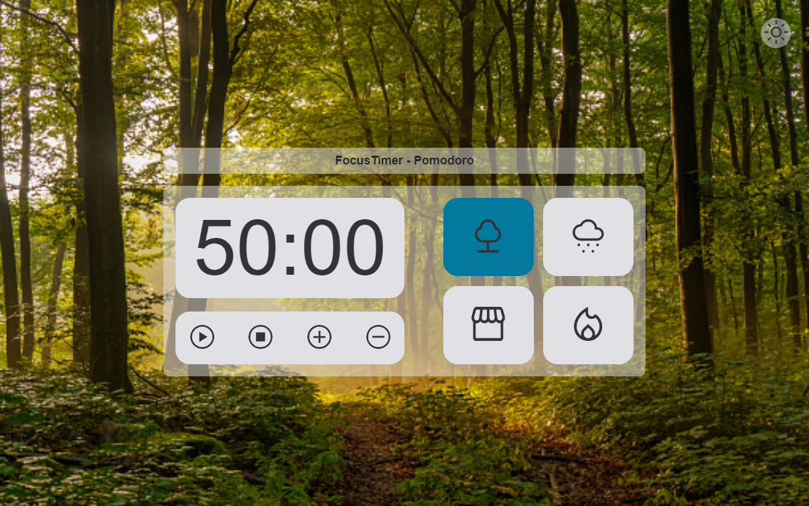

# Focus Timer - Pomodoro

> Trilha Explorer

Projeto construído na trilha Explorer da Rocketseat.

Criado nos anos 80, o pomodoro é um método para gestão de tempo desenvolvido pelo italiano e então universitário Francesco Cirillo. O nome da técnica é uma alusão ao despertador que Francesco utilizou na época para controlar o tempo das suas tarefas: um relógio de cozinha em formato de tomate, ou pomodoro, em italiano.

[🔗 Clique aqui para acessar](https://pinheiroiam.github.io/FocusTimer-v2/)

## 💻 Tecnologias

 - HTML
 - CSS
 - JAVASCRIPT
 - Git e Github

## 📞 Contato

pinheiro.iam@gmail.com

https://www.linkedin.com/in/jo%C3%A3o-paulo-pinheiro-louren%C3%A7o-vidal-4888404a/